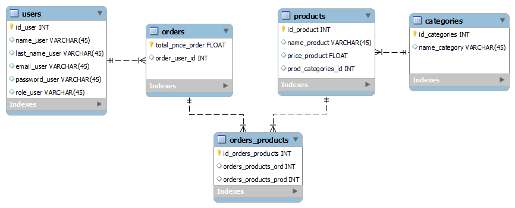

<h2 align="center">BACKEND PROJECT</h2> 
<h1 align="center">🛒 E-COMMERCE REST API 🛍️</h1>
<h4 align="center">with Node, Express & Sequelize</h4>

 <p align="center">
    E-commerce made using Javascript and MySQL database.
    <br />
    <a href="https://github.com/yolovi/proyecto-e-commerce.git"><strong>Explore the docs »</strong></a>
    <br />
    ·
    <a href="https://github.com/yolovi/proyecto-e-commerce.git/issues">Report Bug</a>
    ·
    <a href="https://github.com/yolovi/proyecto-e-commerce.git/issues">Request Feature</a>
  </p>
</div>

## <h1 align="center"> ⚙️ Description | Development </h1>

In the backend project, we will combine the knowledge acquired in node + express technologies, as well as mysql/sequelize to develop an API. The proposed exercise is an e-commerce application where CRUD operations will be implemented for users, products, orders, and categories.


### Challenge 🎢 & Skills Achieved

After analyzing the project requirements, I have created a REST API capable of the following points:

- User registration using Bcrypt.
- User login + token + middleware.
- Implementing CRUD operations.
- At least one Many-to-Many relationship and one One-to-Many relationship.
- Utilization of seeders.
- Validations.

Note that this project was completed within a ten-day timeframe as part of an exercise for The Bridge Valencia's FullStack Bootcamp.

### Technologies used :

    [](https://documenter.getpostman.com/view/28231675/2s93zGzy73)


#### Others:
```Bash
...

 "dependencies": {
    "bcryptjs": "^2.4.3",
    "express": "^4.18.2",
    "jsonwebtoken": "^9.0.0",
    "mysql2": "^3.4.3",
    "sequelize": "^6.32.1"
  },
  "devDependencies": {
    "nodemon": "^2.0.22"
  }
  
```

For this project I have made a diagram creating different tables and the relationship between them (1:N, N:M, N:M).



It has been a challenging project, with the most complicated aspects being the many-to-many relationships and validations, such as checking if an ID exists when creating an order or requesting a specific product. The logic in these cases is complex.

# <h1 align="center"> 🖥️ Using the Postman to testing the REST API  </h1>

[](https://documenter.getpostman.com/view/28231675/2s93zGzy73)
[Link_to_documentation](https://documenter.getpostman.com/view/28231675/2s93zGzy73)
## TODO lists ✔
#### CRUD is the acronym for CREATE, READ, UPDATE and DELETE. These terms describe the four essential operations for creating and managing persistent data elements, mainly in relational and NoSQL databases.

### Product CRUD

- [✔] Endpoint to create a product
- [✔] Endpoint to update a product
- [✔] The endpoint to retrieve products should also display the category or categories they belong to
- [✔] Endpoint to retrieve a product by its ID
- [✔] Filter to search for a product by name
- [✔] Filter to search for a product by price
- [✔] Filter to sort products by price from highest to lowest
- [✔] Implement validation when creating a product to ensure all fields are filled, returning a message if not
- [✔] Only authenticated users can create, update, and delete products.

### Category CRUD

- [✔] Endpoint to create a category
- [✔] Endpoint to update a category
- [✔] Endpoint to delete a category
- [✔] The endpoint to view all categories should display the products they contain
- [✔] Create an endpoint to retrieve a category by its ID
- [✔] Filter to search for a category by name

### Order CRUD

- [✔] Create an endpoint to view orders along with the products they contain
- [✔] Create an endpoint to create orders

### User CRUD

- [✔] Endpoint to register a user using bcrypt
- [✔] Endpoint for user login (using bcrypt + JWT)
- [✔] Endpoint to retrieve information about the logged-in user, including their orders and the products within each order
- [✔] Endpoint for user logout
- [✔] Implement validation when creating a user to ensure all fields are filled, returning a message if not

### Seeders

- [✔] Create 5 products with a seeder

### Custom Extras Implemented

- [✔] ORDER: Improved the create order endpoint: if the user provides a non-existent product ID, it generates an error and informs the user that the product in their order was not found.
- [✔] SEEDER: Create a seeder for users (8) and categories (4)
- [✔] PRODUCT: Display products in ascending order of prices
- [✔] PRODUCT: Filter by price range
- [✔] PRODUCT: Update product > display an error message if the ID does not exist
- [✔] PRODUCT: Insert product in an order > display an error message if the ID does not exist

## IMPLEMENT ✔
## Future Roadmap. Extras:

Role implementation:
- [ ] Create an Admin role and only allow users with that role to create, update, and delete products.
- [ ] Research what multer middleware is and implement it to attach images when creating or updating products.

CRUD reviews
- [ ] The endpoint to retrieve reviews should display the user who made the review
- [ ] Update the endpoint to retrieve all products to display the products along with their categories and reviews
- [ ] Update the endpoint to retrieve a product by ID to display the product along with its categories and reviews

Others:
- [ ] PRODUCT: get all by name. Retrieve all products that match a part of the name passed as a parameter.
- [ ] USER: Display all users (Admin)
- [ ] CATEGORY: Display all categories
- [ ] CATEGORY: Create, update, and delete (Admin only)
- [ ] VALIDATIONS: Add Regex validations for email and password
- [ ] CONFIRMATION EMAIL. Add send email from sever
- [ ] API testing.

## 🔗 Contributing


Contributions are what make the open source community such an amazing place to learn, inspire, and create. Any contributions you make are **greatly appreciated**.

If you have a suggestion that would make this better, please fork the repository and create a pull request. You can also simply open an issue with the tag "enhancement".
Don't forget to give the project a star! Thanks again!

1. Fork the project
2. Create your feature Branch (`git checkout -b feature/YourName`)
3. Commit your changes (`git commit -m 'Add some YourName`)
4. Push to the branch (`git push origin feature/YourName`)
5. Open a pull request.

## 📫 How to reach me:


<a href="https://www.linkedin.com/in/yolanda-lv/" target="_blank"></a>

📩 Or if you want to send me an email: **yolandalopevi@gmail.com**


### Developed by [_Yolanda López Vidal_](https://github.com/yolovi).


