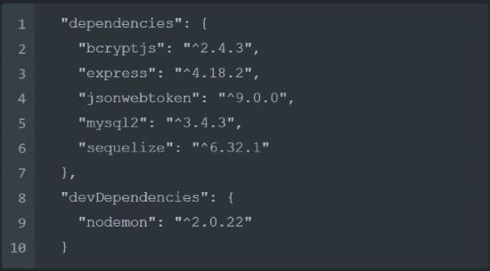

# E-COMMERCE API with Node, Express & Sequelize

## Description 🤨
In the backend project, we will combine the knowledge acquired in node + express technologies, as well as mysql/sequelize to develop an API. The proposed exercise is an e-commerce application where CRUD operations will be implemented for users, products, orders, and categories.

### Technologies used 👩‍💻
* MySql
* Express
* [Sequelize](https://sequelize.org/)
* [Postman](https://www.postman.com/)

* Others:

### Challenge 🎢 & Skills Achieved 👨‍🎓
After analyzing the project requirements, it is expected that the student will develop a REST API capable of the following:

* User registration using Bcrypt.
* User login + token + middleware.
* Implementing CRUD operations.
* At least one Many-to-Many relationship and one One-to-Many relationship.
* Utilization of seeders.
* Validations.

It has been a challenging project, with the most complicated aspects being the many-to-many relationships and validations, such as checking if an ID exists when creating an order or requesting a specific product. The logic in these cases is complex.

### Postman Documentation 📺
[Link_to_documentation](https://documenter.getpostman.com/view/28231675/2s93zGzy73)

## TODO lists ✔

### Product CRUD
- [✔] Endpoint to create a product
- [✔] Endpoint to update a product
- [✔] The endpoint to retrieve products should also display the category or categories they belong to
- [✔] Endpoint to retrieve a product by its ID
- [✔] Filter to search for a product by name
- [✔] Filter to search for a product by price
- [✔] Filter to sort products by price from highest to lowest
- [✔] Implement validation when creating a product to ensure all fields are filled, returning a message if not
- [✔] Only authenticated users can create, update, and delete products.

### Category CRUD
- [✔] Endpoint to create a category
- [✔] Endpoint to update a category
- [✔] Endpoint to delete a category
- [✔] The endpoint to view all categories should display the products they contain
- [✔] Create an endpoint to retrieve a category by its ID
- [✔] Filter to search for a category by name

### Order CRUD
- [✔] Create an endpoint to view orders along with the products they contain
- [✔] Create an endpoint to create orders

### User CRUD
- [✔] Endpoint to register a user using bcrypt
- [✔] Endpoint for user login (using bcrypt + JWT)
- [✔] Endpoint to retrieve information about the logged-in user, including their orders and the products within each order
- [✔] Endpoint for user logout
- [✔] Implement validation when creating a user to ensure all fields are filled, returning a message if not

### Seeders
- [✔] Create 5 products with a seeder

## IMPLEMENT ✔
### Extras
Role implementation:
- [x] Create an Admin role and only allow users with that role to create, update, and delete products.
- [x] Research what multer middleware is and implement it to attach images when creating or updating products.

CRUD reviews
- [x] The endpoint to retrieve reviews should display the user who made the review
- [x] Update the endpoint to retrieve all products to display the products along with their categories and reviews
- [x] Update the endpoint to retrieve a product by ID to display the product along with its categories and reviews

### Custom Extras
- [✔] ORDER: Improved the create order endpoint: if the user provides a non-existent product ID, it generates an error and informs the user that the product in their order was not found.
- [✔] SEEDER: Create a seeder for users (8) and categories (4)
- [✔] PRODUCT: Display products in ascending order of prices
- [✔] PRODUCT: Filter by price range
- [✔] PRODUCT: Update product > display an error message if the ID does not exist
- [✔] PRODUCT: Insert product in an order > display an error message if the ID does not exist
- [x] PRODUCT: get all by name. Retrieve all products that match a part of the name passed as a parameter.
- [x] USER: Display all users (Admin)
- [x] CATEGORY: Display all categories
- [x] CATEGORY: Create, update, and delete (Admin only)
- [x] VALIDATIONS: Regex validations for email and password
- [x] CONFIRMATION EMAIL

### WEBGRAPHY 💻

* [Sequelize](https://sequelize.org/)
* [Postman](https://www.postman.com/)

### Author 🤓
[Yolanda López](https://github.com/yolovi)